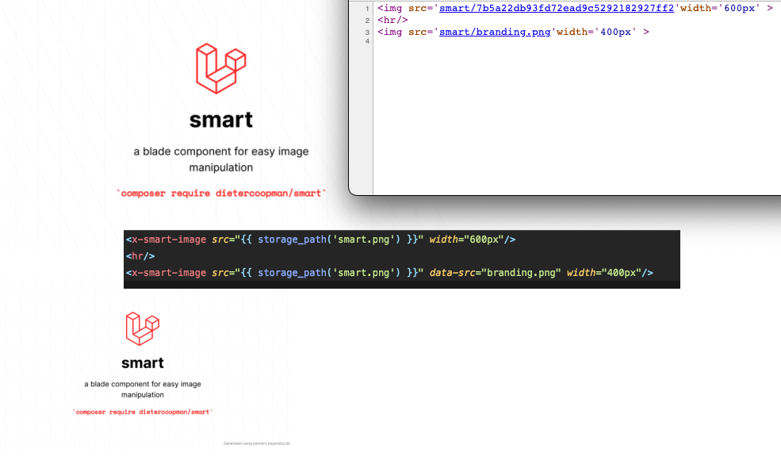

# A blade component for easy image manipulation

Want to serve images from any location ( public, storage or disk ( wip ) ) ?  Want to resize your images before sending them to the browser ? Want to cache them ? Want to apply templates to images ? Then smart might be your buddy !

This package makes it possible to
- **serve images** from anywhere, this might be a public path , a private path or a Laravel disk 
- **resize images** not only by defining height and with in the image tag but by really resizing the source file
- resizing public hosted images **without coding** 
- **apply templates** to images, change the settings for all images from one place 
- automatically **cache** your images
- apply the **full intervention/image API** to an image 

## Installation

You can install the package via composer:

```bash
composer require dietercoopman/smart
```

you can optionaly publish the config file if you want to use templates or change some settings ( see advanced usage with templates )

```bash
php artisan vendor:publish --tag=smart-config
```

## The blade component

Smart provides you with a **blade component** as replacement for the normal `` html tag.  You can pass in all html attributes , they will be applied.   This example will **serve a file that is not public accessible** and **resize it** to 400px maintaining the aspect ratio.  You can apply the full intervention/image API to a smart image ( see advanced usage with templates )

```html
<x-smart-image src="{{ storage_path('smart.png') }}" width="400px"/>
```

This will parse the image , cache it and serve to your browser

```html

```

It's also possible to **handle public hosted files** but **changing** the image **size** , so execute a real resize on the image stream and not only telling the browser to show it at other dimensions.
```html
<x-smart-image src="https://raw.githubusercontent.com/dietercoopman/smart/main/tests/test.png" width="600px" />
```



## Caching 

The images are cached with the intervention/image cache. Default the package will generate a key to store the images in the cache.  This key will be used to build the src of the file, making it possible for browsers to cache the image.
This key is a random generated but you can override it if you want a more descriptive name for your images.

This can be done by setting the `data-src` attribute for your smart image.

```html
<x-smart-image src="{{ storage_path('smart.png') }}" data-src="branding.png" width="400px"/>
```

this will generate this html as output

```html

```

### Here you see the caching in action


## Advanced usage with templates 

Via the `data-template`attribute you can specify which template your image should use.  The templates are configurable in the `config/smart.php` config file.

Here's the default config 

```
<?php

$constraint = function ($constraint) {
    $constraint->aspectRatio();
};

return [
    'image' => [
        'path'      => 'smart',
        'templates' => [
            'small' => [
                'resize' => [200, null, $constraint],
            ],
            'big'   => [
                'resize' => [500, null, $constraint],
            ]
        ]
    ]
];
```

The `path` key defines the url prefix for smart, it defaults to smart but it can be whatever you want.

There are two templates defined by default, `small` and `big` , within the configuration you can define what settings needs to be applied to your images.  The possible settings are the method names as stated in the [intervention image](http://image.intervention.io/) API.  You can create as many template as you want

For example, if you want to use the `resize` method from intervention/image then you define a resize array with the arguments as array value, defined as a sub array. All methods from the api can be used.  Here's an example of a config and the result


## Changelog

Please see [CHANGELOG](CHANGELOG.md) for more information on what has changed recently.

## Contributing

Please see [CONTRIBUTING](.github/CONTRIBUTING.md) for details.

## Security Vulnerabilities

Please review [our security policy](../../security/policy) on how to report security vulnerabilities.

## Credits

- [Dieter Coopman](https://github.com/dietercoopman)
- [All Contributors](../../contributors)

## License

The MIT License (MIT). Please see [License File](LICENSE.md) for more information.
